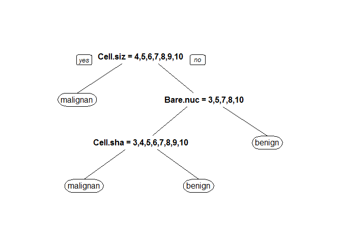

乳癌預測模型
================

資料前處理
----------

#### 資料讀取

此資料來源為UCI Machine Learning Repository。

資料由威斯康星大學醫院 威斯康星州麥迪遜市Dr.Wolberg醫生提供，記載由各個醫療檢測紀錄相關，記錄到的各個探勘數值，一共有9個參數，依序有叢厚度、細胞均勻大小、細胞形狀、細胞邊際附著力、單上皮細胞尺寸、裸核、布蘭德染色質、普通核仁、有絲分裂情形。 主要由這些參數，對照紀錄，來判斷是否會得到乳癌的可能。 另外，分類結果為二元分類，良性(benign)及惡性(malignant)。

``` r
#install.packages("mlbench")
library(mlbench)
```

    ## Warning: package 'mlbench' was built under R version 3.2.5

``` r
data(BreastCancer)
str(BreastCancer)
```

    ## 'data.frame':    699 obs. of  11 variables:
    ##  $ Id             : chr  "1000025" "1002945" "1015425" "1016277" ...
    ##  $ Cl.thickness   : Ord.factor w/ 10 levels "1"<"2"<"3"<"4"<..: 5 5 3 6 4 8 1 2 2 4 ...
    ##  $ Cell.size      : Ord.factor w/ 10 levels "1"<"2"<"3"<"4"<..: 1 4 1 8 1 10 1 1 1 2 ...
    ##  $ Cell.shape     : Ord.factor w/ 10 levels "1"<"2"<"3"<"4"<..: 1 4 1 8 1 10 1 2 1 1 ...
    ##  $ Marg.adhesion  : Ord.factor w/ 10 levels "1"<"2"<"3"<"4"<..: 1 5 1 1 3 8 1 1 1 1 ...
    ##  $ Epith.c.size   : Ord.factor w/ 10 levels "1"<"2"<"3"<"4"<..: 2 7 2 3 2 7 2 2 2 2 ...
    ##  $ Bare.nuclei    : Factor w/ 10 levels "1","2","3","4",..: 1 10 2 4 1 10 10 1 1 1 ...
    ##  $ Bl.cromatin    : Factor w/ 10 levels "1","2","3","4",..: 3 3 3 3 3 9 3 3 1 2 ...
    ##  $ Normal.nucleoli: Factor w/ 10 levels "1","2","3","4",..: 1 2 1 7 1 7 1 1 1 1 ...
    ##  $ Mitoses        : Factor w/ 9 levels "1","2","3","4",..: 1 1 1 1 1 1 1 1 5 1 ...
    ##  $ Class          : Factor w/ 2 levels "benign","malignant": 1 1 1 1 1 2 1 1 1 1 ...

#### 處理資料

``` r
BreastCancerC<-BreastCancer[complete.cases(BreastCancer),
!names(BreastCancer)%in%c("Id")]
c(nrow(BreastCancer),nrow(BreastCancerC))
```

    ## [1] 699 683

#### 分成訓練組跟測試組,並紀錄各組人數

``` r
BreastCancerC$Test<-F
BreastCancerC[
sample(1:nrow(BreastCancerC),nrow(BreastCancerC)/5),]$Test<-T
c(sum(BreastCancerC$Test==F),sum(BreastCancerC$Test==T))
```

    ## [1] 547 136

隨機將4/5的資料分到訓練組（Test==F），剩下1/5為測試組（Test==T〕。 可得訓練組案例數為547，測試組案例數為136。

預測模型建立
------------

#### 模型建立

``` r
library(rpart)
```

    ## Warning: package 'rpart' was built under R version 3.2.5

``` r
BreastCancerC$Class<-factor(BreastCancerC$Class,levels=c("malignant","benign"))

#set.seed(1000)          
fit<-rpart(Class~.,data=BreastCancerC[BreastCancerC$Test==F,]) 

#install.packages("rpart.plot")
library(rpart.plot)
```

    ## Warning: package 'rpart.plot' was built under R version 3.2.5

``` r
summary(fit)
```

    ## Call:
    ## rpart(formula = Class ~ ., data = BreastCancerC[BreastCancerC$Test == 
    ##     F, ])
    ##   n= 547 
    ## 
    ##           CP nsplit  rel error    xerror       xstd
    ## 1 0.83505155      0 1.00000000 1.0000000 0.05767569
    ## 2 0.04896907      1 0.16494845 0.2164948 0.03209778
    ## 3 0.01000000      3 0.06701031 0.1494845 0.02701273
    ## 
    ## Variable importance
    ##       Cell.size      Cell.shape     Bare.nuclei     Bl.cromatin 
    ##              21              18              16              15 
    ##    Epith.c.size Normal.nucleoli    Cl.thickness 
    ##              14              14               1 
    ## 
    ## Node number 1: 547 observations,    complexity param=0.8350515
    ##   predicted class=benign     expected loss=0.3546618  P(node) =1
    ##     class counts:   194   353
    ##    probabilities: 0.355 0.645 
    ##   left son=2 (178 obs) right son=3 (369 obs)
    ##   Primary splits:
    ##       Cell.size    splits as  RRRLLLLLLL, improve=190.2323, (0 missing)
    ##       Cell.shape   splits as  RRRLLLLLLL, improve=186.7047, (0 missing)
    ##       Bare.nuclei  splits as  RRLLLLLLLL, improve=172.7316, (0 missing)
    ##       Bl.cromatin  splits as  RRRLLLLLLL, improve=161.4403, (0 missing)
    ##       Epith.c.size splits as  RRLLLLLLLL, improve=155.1858, (0 missing)
    ##   Surrogate splits:
    ##       Cell.shape      splits as  RRRLLLLLLL, agree=0.941, adj=0.820, (0 split)
    ##       Bare.nuclei     splits as  RRRLLLLLLL, agree=0.899, adj=0.691, (0 split)
    ##       Bl.cromatin     splits as  RRRLLLLLLL, agree=0.899, adj=0.691, (0 split)
    ##       Epith.c.size    splits as  RRRLLLLLLL, agree=0.892, adj=0.669, (0 split)
    ##       Normal.nucleoli splits as  RRLLLLLLLL, agree=0.879, adj=0.629, (0 split)
    ## 
    ## Node number 2: 178 observations
    ##   predicted class=malignant  expected loss=0.04494382  P(node) =0.3254113
    ##     class counts:   170     8
    ##    probabilities: 0.955 0.045 
    ## 
    ## Node number 3: 369 observations,    complexity param=0.04896907
    ##   predicted class=benign     expected loss=0.06504065  P(node) =0.6745887
    ##     class counts:    24   345
    ##    probabilities: 0.065 0.935 
    ##   left son=6 (38 obs) right son=7 (331 obs)
    ##   Primary splits:
    ##       Bare.nuclei     splits as  RRLRL-LL-L, improve=22.37590, (0 missing)
    ##       Cl.thickness    splits as  RRRRRRLLLL, improve=18.26074, (0 missing)
    ##       Normal.nucleoli splits as  RRRLLLRRLL, improve=17.44790, (0 missing)
    ##       Cell.shape      splits as  RRLLLLLLLL, improve=17.23051, (0 missing)
    ##       Bl.cromatin     splits as  RRRLLRL---, improve=16.11943, (0 missing)
    ##   Surrogate splits:
    ##       Normal.nucleoli splits as  RRRRLLLRLL, agree=0.924, adj=0.263, (0 split)
    ##       Bl.cromatin     splits as  RRRLLRL---, agree=0.921, adj=0.237, (0 split)
    ##       Cl.thickness    splits as  RRRRRRLLLL, agree=0.919, adj=0.211, (0 split)
    ##       Cell.shape      splits as  RRRLLLLLLL, agree=0.916, adj=0.184, (0 split)
    ##       Mitoses         splits as  RRLRR-LR-,  agree=0.913, adj=0.158, (0 split)
    ## 
    ## Node number 6: 38 observations,    complexity param=0.04896907
    ##   predicted class=malignant  expected loss=0.4210526  P(node) =0.06946984
    ##     class counts:    22    16
    ##    probabilities: 0.579 0.421 
    ##   left son=12 (23 obs) right son=13 (15 obs)
    ##   Primary splits:
    ##       Cell.shape      splits as  RRLLLLLLLL, improve=13.007480, (0 missing)
    ##       Cl.thickness    splits as  RRRLLLLLLL, improve= 8.469498, (0 missing)
    ##       Normal.nucleoli splits as  RLLLRLR-LL, improve= 7.859649, (0 missing)
    ##       Cell.size       splits as  RLLLLLLLLL, improve= 7.141700, (0 missing)
    ##       Bare.nuclei     splits as  --R-R-LL-L, improve= 4.103127, (0 missing)
    ##   Surrogate splits:
    ##       Cl.thickness    splits as  RRRRLLLLLL, agree=0.895, adj=0.733, (0 split)
    ##       Cell.size       splits as  RLLLLLLLLL, agree=0.895, adj=0.733, (0 split)
    ##       Normal.nucleoli splits as  RLLLLLL-LL, agree=0.842, adj=0.600, (0 split)
    ##       Epith.c.size    splits as  RRLLLLLLLL, agree=0.816, adj=0.533, (0 split)
    ##       Bl.cromatin     splits as  RRLLL-L---, agree=0.789, adj=0.467, (0 split)
    ## 
    ## Node number 7: 331 observations
    ##   predicted class=benign     expected loss=0.006042296  P(node) =0.6051188
    ##     class counts:     2   329
    ##    probabilities: 0.006 0.994 
    ## 
    ## Node number 12: 23 observations
    ##   predicted class=malignant  expected loss=0.08695652  P(node) =0.04204753
    ##     class counts:    21     2
    ##    probabilities: 0.913 0.087 
    ## 
    ## Node number 13: 15 observations
    ##   predicted class=benign     expected loss=0.06666667  P(node) =0.0274223
    ##     class counts:     1    14
    ##    probabilities: 0.067 0.933

``` r
prp(fit)
```

<!-- --> 由於變數多，且多為連續變項，而輸出為二元類別變項，故選擇決策樹演算法來建立模型。

模型說明
--------

由上述參數可知，以決策樹建立模型預測乳房腫瘤是否為陰性或良性，經最佳化後，所用到的參數為上圖的決策樹所示 使用病患資料來預測乳房腫瘤是否為陰性或良性，以決策樹模型預測是否為陰性，可得：

``` r
#install.packages("caret")
library(caret)
```

    ## Warning: package 'caret' was built under R version 3.2.5

    ## Loading required package: lattice

    ## Loading required package: ggplot2

    ## Warning: package 'ggplot2' was built under R version 3.2.5

``` r
MinePred<-predict(fit,newdata = BreastCancerC[BreastCancerC$Test==T,],type = "class")
sensitivity(MinePred,BreastCancerC[BreastCancerC$Test==T,]$Class)#敏感度
```

    ## [1] 0.8979592

``` r
specificity(MinePred,BreastCancerC[BreastCancerC$Test==T,]$Class)#特異性
```

    ## [1] 0.954023

``` r
posPredValue(MinePred,BreastCancerC[BreastCancerC$Test==T,]$Class)#陽性預測率
```

    ## [1] 0.9166667

``` r
negPredValue(MinePred,BreastCancerC[BreastCancerC$Test==T,]$Class)#陰性預測率
```

    ## [1] 0.9431818
